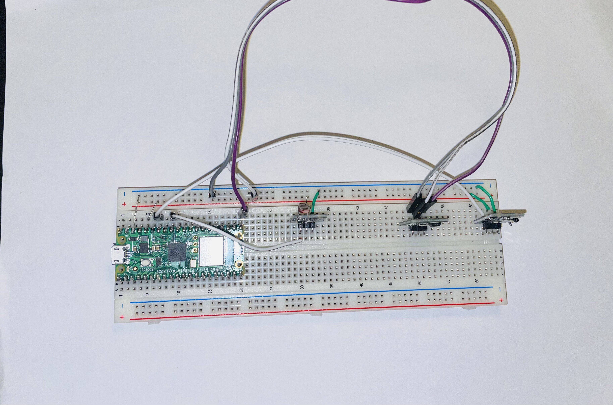
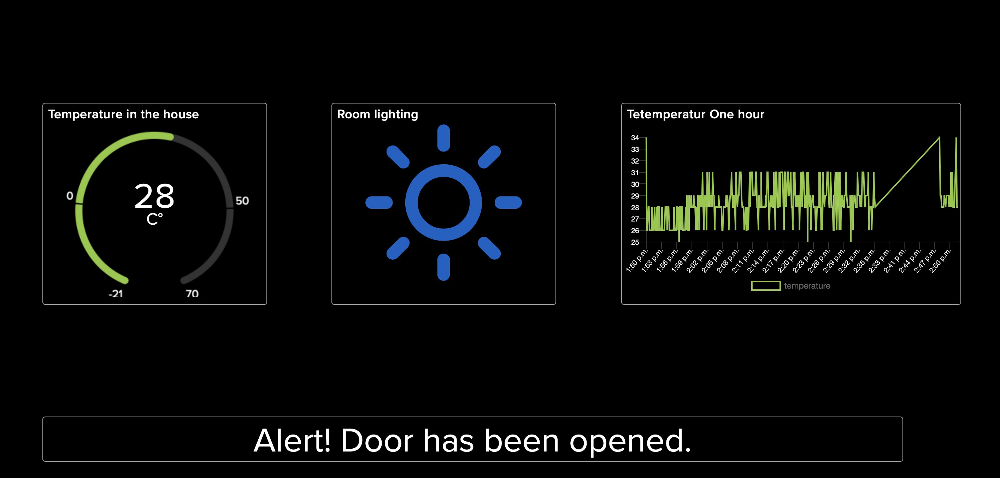
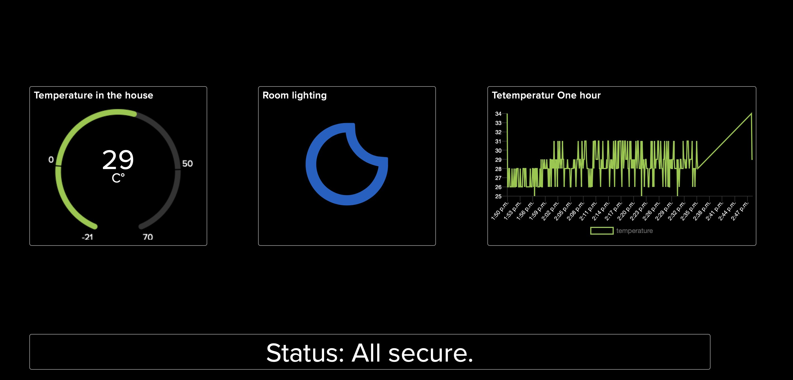
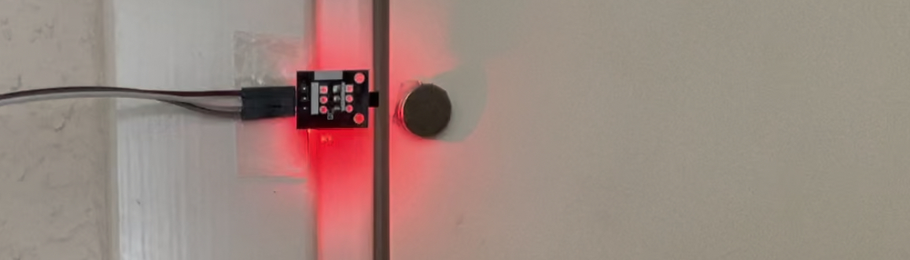
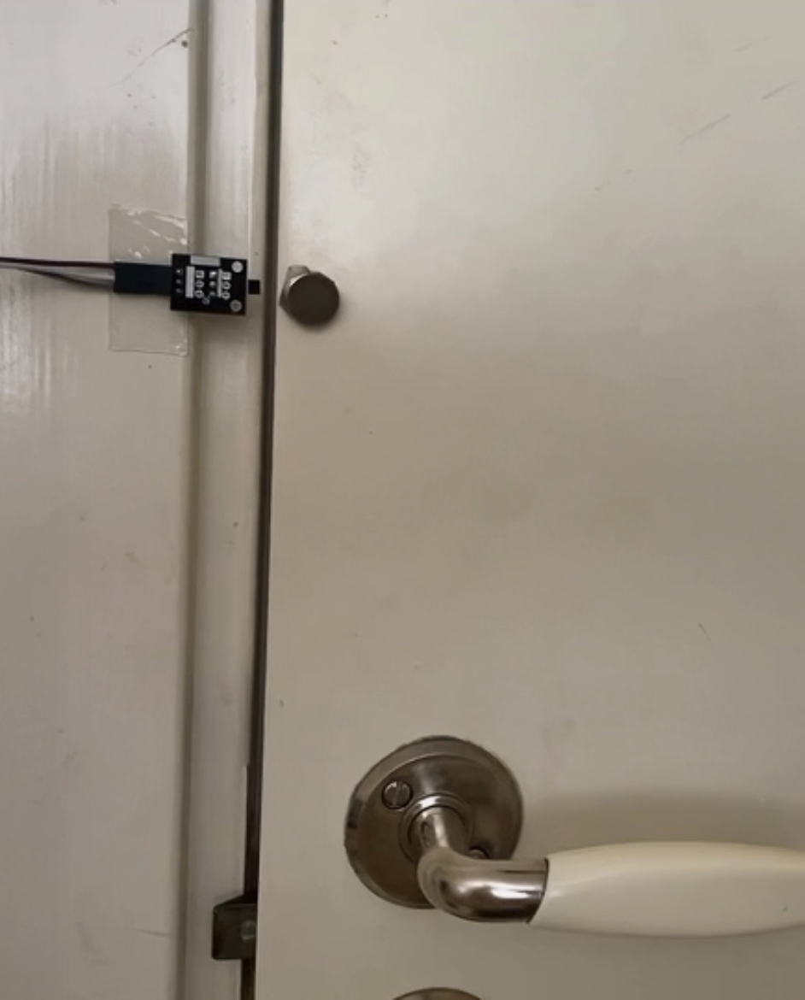

# Home-Safety-Monitoring
Noor Eidirhn Mustafa 
id: nm222up

# overview
The project pertains to home security monitoring. The objective is achieved through three different sensors: temperature, light, and magnetic field sensors. The data received from these sensors will be visualized using Adafruit.
This is a project designed for beginners and, following this tutorial, the estimated time required for completion is between 3 to 5 hours.


# Objective
The aim of this project is to enhance home security by employing a variety of sensors to gather real-time data, which could potentially be lifesaving. Beyond safety, this project could also be utilized for temperature and light monitoring, as well as energy conservation. By providing information on optimal times to switch off lights and heating systems, it fosters efficient energy usage.

# Material


For this project,  the microcontroller Raspberry Pi Pico WH is used . It offers numerous digital and analog inputs and outputs, and is equipped with a 2.4GHz wireless interface. For more info see [datasheet](https://datasheets.raspberrypi.com/picow/pico-w-datasheet.pdf) .

The temperature measurement, the Temperatursensor NTC was choosen, The reason is that it has a larger range. Its measurement range is sufficient for this project, with temperature accuracy from -55°C to +125°C.see [datasheet](https://www.electrokit.com/uploads/productfile/41015/41015732_-_Analog_Temperature_Sensor.pdf). and see the [userguide ](https://www.electrokit.com/uploads/productfile/41015/41015732_-_Analog_Temperature_Sensor.pdf)


In order to measure the lighting in the room , we will use a Light sensor. It can be used as a simple light sensor where the amount of light determines the output signal. It can be directly connected to an analog input on a microcontroller. see [datasheet](https://www.electrokit.com/uploads/productfile/41015/41015727_-_Photoresistor_Module.pdf). And see hte[ userguide](https://www.electrokit.com/uploads/productfile/41015/41015727_-_Photoresistor_Module.pdf) 

A Hall effect sensor for detecting magnetism. The sensor's output remains high as long as it is not in proximity to a magnet, and it pulls the output low when exposed to a magnetic field above a certain threshold. this sensor will  be placed nere by the door with a  magnet. see [datasheet](https://www.electrokit.com/uploads/productfile/41015/41015730_A314x-Datasheet.pdf) and the [user guide](https://www.electrokit.com/uploads/productfile/41015/41015730_-_Digital_Halleffect_Sensor.pdf). 


Additionally, we will require a breadboard and several jumpers to facilitate connections. A micro-USB cable is also necessary for connection to our computer, which will also function as our power source. 

| Material | price | Name and where to buy |
|:--------:|:-------:|:-------:|
| | 39.00 SEK  | [Hall effect sensor  electrokit](https://www.electrokit.com/uploads/productimage/41015/41015730.jpg) |
| | 39.00 SEK  | [Light sensor electrokit](https://www.electrokit.com/produkt/ljussensor/) |
| | 29.00 SEK  | [ Temperatursensor NTC electrokit](https://www.electrokit.com/produkt/temperatursensor-ntc/) |
| | 109.00 SEK  | [ raspberry pi pico wh electrokit](https://www.electrokit.com/produkt/raspberry-pi-pico-wh/) |
| | 69.00 SEK  | [ Breadboard electrokit](https://www.electrokit.com/produkt/kopplingsdack-840-anslutningar/) |
| | 16.00 SEK  | [ USB-kabel A-hane  electrokit](https://www.electrokit.com/produkt/usb-kabel-a-hane-micro-b-hane-15cm/) |
| | 29.00 SEK  | [ Jumper cables M-to-M electrokit](https://www.electrokit.com/produkt/labsladd-1-pin-hane-hane-150mm-10-pack/) |


# Computer setup


## Step-by-step


1. install [Python](https://www.python.org/downloads/macos/).
2. Download and install [NodeJS](https://nodejs.org/en/download). 
3. Make sure to acquire the current version, not LTS.
4. install the [IDE VSCode](https://code.visualstudio.com/Download).
5. add the Pymakr plugin to your VS Cod 

- Open VS Code.
- Access the Extensions Manager by:
- Clicking on the Extensions icon located on the left panel,
- Selecting 'Extensions' from the 'View' dropdown menu, or

- Once you're in the Extensions Manager, search for 'Pymakr'.
- Select 'Install' to add the Pymakr extension to your VS Code.

6.Update firmware on the Raspberry Pi Pico:

* Download the MicroPython [firmware ](https://micropython.org/download/rp2-pico-w/).. Ensure to get the latest one from Releases.
* Connect the micro-USB cable to the Raspberry Pi Pico.
* While pressing the BOOTSEL button on the board, connect the other end of the micro-USB cable to your computer. You can release the BOOTSEL button after plugging it in.
* A new drive named RPI-RP2, which is the Raspberry Pi Pico storage, should appear in your file system. Transfer the uf2 file that you downloaded earlier into this storage.
*  Wait for the board to automatically disconnect and reconnect (or just discounnect ).
<br>
  

# Putting everything together
### obs 
For more detailed information, please refer to the user guide mentioned above.


bilden av kretsen 

# platform 
The platform of choice for this project is [Adafruit](https://www.adafruit.com). It is free and ideal for beginners due to its ease of use. Additionally, it offers simple visualization tools for presenting your data.
 Adafruit is a cloud-based service and Internet of Things platform. the user have the opportunity to  log, analyze, and visualize data from electronic devices. 
### obs 
Platforms like AWS IoT, Google Cloud IoT, or Microsoft Azure IoT provide more advanced features, but they also require more advanced knowledge to use effectively. it is a good ide to try them if we want to scale this project. 

# Code 
This code is for connecting the Temperatursensor NTC. 
First, we import the necessary libraries, such as machine and ADC(analog-to-digital converter). 
Then, we read the value from the sensor and convert it to Celsius.
``` python
def get_temp():

    thermistor_pin = ADC(28)

    try:
        RawADC = thermistor_pin.read_u16()
        Temp = math.log(((10240000 / RawADC) - 10000))
        Temp = 1 / (0.001129148 + (0.000234125 + (0.0000000876741 * Temp * Temp ))* Temp)
        Temp = Temp - 273.15  # Convert Kelvin to Celsius
       


        return round(Temp) 
    except Exception as error:
        print("Exception occurred", error)
        return None 
```
We're utilizing a light sensor. The raw value the sensor gives can reach up to 65535, so we need to convert this to a percentage of darkness by dividing the raw reading by 65535 and multiplying by 10000.

if it is dark in the room, we send a string "w:night-clear" back to the server. This string is translated to a half-moon icon on the server side to indicate nighttime conditions.

Alternatively, if the light levels are normal , we send the string "w:day-sunny". This string is translated into a sun icon on the server side to indicate daytime or well-lit conditions.
``` python

def check_light():
   
    ldr = ADC(Pin(27))


    light = ldr.read_u16()
    darkness = round(light / 65535 * 10000, 2)
    if darkness >= 70:


        return "w:night-clear"
    else:


        return "w:day-sunny"

```

This code is located in the boot.py file, where we place the code we want to run first. The first thing we want to do is establish a WiFi connection. The function attempts to connect by sending a request to the WiFi; if the connection is successful, the IP address assigned to our board is returned.

``` python

def connect():
    import network
    from time import sleep
    from secrets import secrets
    import machine

    wlan = network.WLAN(network.STA_IF)        

    if not wlan.isconnected():                 
        print('connecting to network...')
        wlan.active(True)                     

        wlan.config(pm = 0xa11140)
        wlan.connect(secrets["ssid"], secrets["password"]) 
        print('Waiting for connection...', end='')

        while not wlan.isconnected() and wlan.status() >= 0:
            print('.', end='')
            sleep(1)

    ip = wlan.ifconfig()[0]
    print('\nConnected on {}'.format(ip))
    return ip 

try:
    ip = connect()
except KeyboardInterrupt:
    print("Keyboard interrupt")

```


Here in the main.py, we are importing methods that fetch data from sensors. Then, we attempt to send this data to Adafruit.
these global variables that are initialized with feed names from Adafruit. These global variables are used to send data to the correct dashboard.

``` python

from tempsensor import get_temp
from lightsensor import check_light
from magnetdetected import is_magnet_detected

AIO_SERVER = "io.adafruit.com"
AIO_PORT = 1883
AIO_USER = "yourname"
AIO_KEY = "ad"

AIO_CLIENT_ID = ubinascii.hexlify(machine.unique_id())  
AIO_LIGHTS_FEED = "noorMustafa/feeds/lighting"
AIO_TEMP_FEED = "noorMustafa/feeds/temperature"
AIO_DOOR_FEED = "noorMustafa/feeds/door"


# Try WiFi Connection
try:
    ip = connect()
except KeyboardInterrupt:
    print("Keyboard interrupt")

# Use the MQTT protocol to connect to Adafruit IO
client = MQTTClient(AIO_CLIENT_ID, AIO_SERVER, AIO_PORT, AIO_USER, AIO_KEY)

# Subscribed messages will be delivered to this callback
client.set_callback(sub_cb)
client.connect()
client.subscribe(AIO_LIGHTS_FEED)
print("Connected to %s, subscribed to %s topic" % (AIO_SERVER, AIO_LIGHTS_FEED))


try: 
    while 1:  
        client.check_msg() 
 
        client.publish(topic=AIO_TEMP_FEED, msg=str(get_temp()))
        client.publish(topic=AIO_LIGHTS_FEED , msg=str(check_light()))
        client.publish(topic=AIO_DOOR_FEED , msg=str(is_magnet_detected()))


        time.sleep(8)
```

# Transmitting the data / connectivity

The data from the  sensors is transmitted to the Adafruit platform via the internet using the MQTT protocol over a Wi-Fi connection.

Wi-Fi is good enough for the most . But, Wi-Fi consume battery  because it sends a lot of data and stays connected all the time. This can be a problem for devices running on battery. To save battery, you can set your device to sleep when it's not sending data.

MQTT is a simple system that doesn't really affect the range .MQTT is made to use very little power and data, which is why it's great for Internet of Things (IoT) devices. It uses a system where devices only 'wake up' and use power when they need to send data or get data .


# Presenting the data
To begin with, we create feeds that function as APIs to the dashboard. Please follow the link to create [different feeds](https://learn.adafruit.com/adafruit-io-basics-feeds/creating-a-feed) . The feeds used in this project are:

"noorMustafa/feeds/lighting"
"noorMustafa/feeds/temperature"
"noorMustafa/feeds/door"
These three feeds are linked to a dashboard where the results of all three sensors are presented. se how to create [a dashboard ](https://learn.adafruit.com/adafruit-io-basics-dashboards)
It's worth mentioning that the permitted calls per minute for a free Adafruit account are 30 data points per minute. To maintain the limit for a free account, we send three data points every 8 seconds.






# Finalizing the design
 the door is closed and all is secure


the door is oppen 



